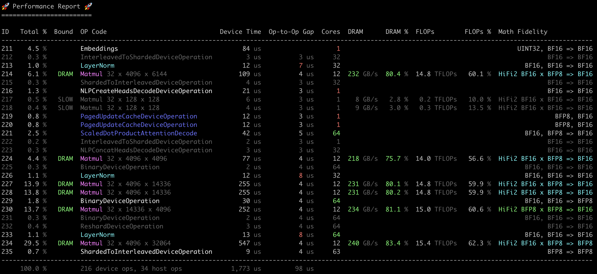

# Performance Report Analysis Tool



This tool analyzes performance traces from Metal operations, providing insights into throughput, bottlenecks, and optimization opportunities.

## Installation

This tool can be installed from PyPI:

```bash
pipx install tt-perf-report
```

Installing with pipx will automatically create a virtual environment and make the `tt-perf-report` command available.

## Generating Performance Traces

1. Build Metal with performance tracing (enabled in default build):
```bash
./build_metal
```

2. Run your test in TT-Metal with the tracy module to capture traces:
```bash
python -m tracy -r -p -v -m pytest path/to/test.py
```
This generates a CSV file containing operation timing data.

## Using Tracy Signposts

Tracy signposts mark specific sections of code for analysis. Add signposts to your Python code:

```python
import tracy

# Mark different sections of your code
tracy.signpost("Compilation pass")
model(input_data)

tracy.signpost("Performance pass")
for _ in range(10):
    model(input_data)
```

The tool uses the last signpost by default, which is typically the most relevant section for a performance test(e.g., the final iteration after compilation / warmup).

Common signpost usage:
- `--start-signpost NAME`: Analyze ops after the specified signpost
- `--end-signpost NAME`: Analyze ops before the specified signpost
- `--ignore-signposts`: Analyze the entire trace
- `--print-signposts`: Prints any signposts within the window defined when using the start/end signpost arguments

## Filtering Operations

The output of the performance report is a table of operations. Each operation is assigned a unique ID starting from 1. You can re-run the tool with different IDs to focus on specific sections of the trace.

Use `--id-range` to analyze specific sections:
```bash
# Analyze ops 5 through 10
tt-perf-report trace.csv --id-range 5-10

# Analyze from op 31 onwards
tt-perf-report trace.csv --id-range 31-

# Analyze up to op 12
tt-perf-report trace.csv --id-range -12
```

This is particularly useful for:
- Isolating decode pass in prefill+decode LLM inference
- Analyzing single transformer layers without embeddings/projections
- Focusing on specific model components

## Output Options

- `--min-percentage value`: Hide ops below specified % of total time (default: 0.5)
- `--color/--no-color`: Force colored/plain output
- `--csv FILENAME`: Output the table to CSV format for further analysis or inclusion into automated reporting pipelines
- `--no-advice`: Show only performance table, skip optimization advice
- `--active-experts K`: Use K active experts per input batch group for `ttnn.sparse_matmul` rows whose CSV attributes do not include numeric `nnz`
- `--arch ARCH`: Override architecture/SKU detection. Use `p100` for Blackhole P100 traces because profiler CSVs identify the chip family but not the card SKU.

## Understanding the Performance Report

The performance report provides several key metrics for analyzing operation performance:

### Core Metrics

- **Device Time**: Time spent executing the operation on device (in microseconds)
- **Op-to-op Gap**: Time between operations, including host overhead and kernel dispatch (in microseconds)
- **Total %**: Percentage of total execution time spent on this operation
- **Cores**: Number of compute cores used by the operation. The available-worker ceiling is read from newer profiler CSVs.
  DRAM-sharded matmuls use the architecture's DRAM-interface workers: 12 on Wormhole, 8 on Blackhole P150, and 7 on Blackhole P100.

### Performance Metrics

- **DRAM**: Memory bandwidth achieved (in GB/s)
- **DRAM %**: Percentage of theoretical peak DRAM bandwidth (288 GB/s on Wormhole, 512 GB/s on Blackhole P150, or 448 GB/s on Blackhole P100)
- **Overall DRAM roofline**: The total row reports modeled DRAM bandwidth and DRAM % across the visible report window
- **FLOPs**: Compute throughput achieved (in TFLOPs)
- **FLOPs %**: Percentage of theoretical peak compute for the given math fidelity
- **Bound**: Performance classification of the operation:
  - `DRAM`: Memory bandwidth bound (>65% of peak DRAM)
  - `FLOP`: Compute bound (>65% of peak FLOPs)
  - `BOTH`: Both memory and compute bound
  - `SLOW`: Neither memory nor compute bound
  - `HOST`: Operation running on host CPU

### Additional Fields

- **Math Fidelity**: Precision configuration used for matrix operations. Utilization is based on the operation's actual core count. Blackhole-family per-core peaks use phase divisors (HiFi4=/4, HiFi3=/3, HiFi2=/2, LoFi=/1). Wormhole uses published chip peaks; HiFi3 is HiFi4×4/3 (LoFi is empirical). Full-chip reference peaks are:
  - `HiFi4`: Highest precision — Wormhole 74 TFLOPs, Blackhole ~166 TFLOPs
  - `HiFi3`: High precision — Wormhole ~98.7 TFLOPs, Blackhole ~221 TFLOPs
  - `HiFi2`: Medium precision — Wormhole 148 TFLOPs, Blackhole ~332 TFLOPs
  - `LoFi`: Lowest precision — Wormhole 262 TFLOPs, Blackhole ~664 TFLOPs

The tool automatically highlights potential optimization opportunities:
- Red op-to-op times indicate high host or kernel launch overhead (>6.5μs)
- Red core counts indicate underutilization (<10 cores), excluding architecture-standard DRAM-sharded matmuls
- Green core counts indicate either all available workers or the expected DRAM-sharded worker count
- Yellow metrics indicate room for optimization

## Examples


> **Note:**  
> `trace.csv` in the examples below refers to your input CSV file (the performance trace you want to analyze).

Typical use:

```bash
tt-perf-report trace.csv
```

Merge traces captured on multiple machines from the same workload run:

```bash
tt-perf-report trace_host0.csv trace_host1.csv trace_host2.csv
```

Build a table of all ops with no advice:

```bash
tt-perf-report trace.csv --no-advice
```

View ops 100-200 with advice:

```bash
tt-perf-report trace.csv --id-range 100-200
```

Export the table of ops and columns as a CSV file:

```bash
tt-perf-report trace.csv --csv my_report.csv
```
