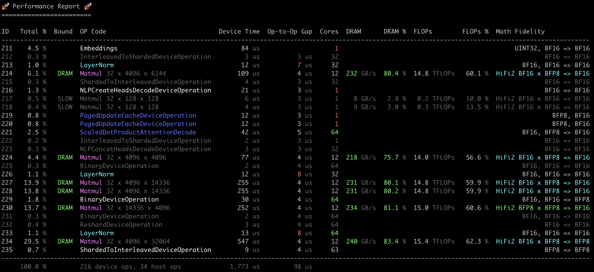

# Performance Report Analysis Tool



This tool analyzes performance traces from Metal operations, providing insights into throughput, bottlenecks, and optimization opportunities.

## Installation

This tool can be installed from PyPI:

```bash
pipx install tt-perf-report
```

Installing with pipx will automatically create a virtual environment and make the `tt-perf-report` command available.

## Generating Performance Traces

1. Build Metal with performance tracing (enabled in default build):
```bash
./build_metal
```

2. Run your test in TT-Metal with the tracy module to capture traces:
```bash
python -m tracy -r -p -v -m pytest path/to/test.py
```
This generates a CSV file containing operation timing data.

## Using Tracy Signposts

Tracy signposts mark specific sections of code for analysis. Add signposts to your Python code:

```python
import tracy

# Mark different sections of your code
tracy.signpost("Compilation pass")
model(input_data)

tracy.signpost("Performance pass")
for _ in range(10):
    model(input_data)
```

The tool uses the last signpost by default, which is typically the most relevant section for a performance test(e.g., the final iteration after compilation / warmup).

Common signpost usage:
- `--start-signpost NAME`: Analyze ops after the specified signpost
- `--end-signpost NAME`: Analyze ops before the specified signpost
- `--ignore-signposts`: Analyze the entire trace
- `--print-signposts`: Prints any signposts within the window defined when using the start/end signpost arguments

## Filtering Operations

The output of the performance report is a table of operations. Each operation is assigned a unique ID starting from 1. You can re-run the tool with different IDs to focus on specific sections of the trace.

Use `--id-range` to analyze specific sections:
```bash
# Analyze ops 5 through 10
tt-perf-report trace.csv --id-range 5-10

# Analyze from op 31 onwards
tt-perf-report trace.csv --id-range 31-

# Analyze up to op 12
tt-perf-report trace.csv --id-range -12
```

This is particularly useful for:
- Isolating decode pass in prefill+decode LLM inference
- Analyzing single transformer layers without embeddings/projections
- Focusing on specific model components

## Output Options

- `--min-percentage value`: Hide ops below specified % of total time (default: 0.5)
- `--color/--no-color`: Force colored/plain output
- `--csv FILENAME`: Output the table to CSV format for further analysis or inclusion into automated reporting pipelines
- `--no-advice`: Show only performance table, skip optimization advice
- `--active-experts K`: Use K active experts per input batch group for `ttnn.sparse_matmul` rows whose CSV attributes do not include numeric `nnz`
- `--arch ARCH`: Override architecture/SKU detection. Use `p100` for Blackhole P100 traces because profiler CSVs identify the chip family but not the card SKU.

## Understanding the Performance Report

The performance report provides several key metrics for analyzing operation performance:

### Core Metrics

- **Device Time**: Time spent executing the operation on device (in microseconds)
- **Op-to-op Gap**: Time between operations, including host overhead and kernel dispatch (in microseconds). A negative gap means the operation started before its predecessor finished, which is what concurrent subdevices look like; it is shown as reported but adds nothing to the gap total or to **Total %**
- **Total %**: This operation's share of the report's summed device time and op-to-op gaps. The shares always sum to 100%. When operations overlap, that sum is larger than the wall-clock time, so a share of summed time is not a share of elapsed time (see **Overlap**)
- **Overlap**: On a run partitioned into subdevices, how much of this operation's device time was already covered by an earlier operation on the same device, i.e. the ops ran concurrently on disjoint core ranges. It is blank when there is no overlap, and blank throughout on a run that is not partitioned. The terminal table only shows the column when some op overlapped; `--csv` always emits it.
  - When ops overlap, a line under the total row gives the wall-clock **busy time** alongside the summed op time. The overall DRAM roofline (both its GB/s and its DRAM %) and the tracing-savings estimate are then computed against busy time. **Total %** and the summary report's **Device Time Sum** and percentages stay based on summed op time.
  - Each op is placed in time as the interval ending at `DEVICE FW END CYCLE` and lasting its kernel duration. Cycles are converted with a ratio read from the file (`DEVICE FW DURATION [ns]`), and ops on different devices are never compared, because device clocks are not synchronised. The anchoring is empirical: raw FW start-to-end spans overlap even on sequential runs, while these intervals do not on any sequential capture tested.
  - Ops running concurrently still share one memory system, so their **DRAM %** figures can add up to more than 100% of the chip, and so can the overall DRAM %.
  - With `--id-range`, overlap is measured among the ops in the range only, so an op is not shown as overlapping one the range left out.
- **Cores**: Number of compute cores used by the operation.
  DRAM-sharded matmuls use the architecture's DRAM-interface workers: 12 on Wormhole, 8 on Blackhole P150, and 7 on Blackhole P100.
- **Available Cores**: Worker cores the operation could have used, read per operation from newer profiler CSVs. On a run that partitions the chip into subdevices this is that subdevice's own budget; otherwise it is the full worker grid the profiler reports. When the whole column is absent it falls back to the architecture's registered grid (e.g. 64 on Wormhole, 110 on Blackhole, 20 on `bh20` and `n1`); when only an individual cell is blank or malformed, it falls back to the largest budget the file does report, which on a partitioned run may be another subdevice's. Grid-size advice and the **Cores** coloring are measured against this value rather than against the whole chip; **FLOPs %** is unaffected, since utilization is based on the cores the operation actually used
- **Sub Device ID**: Subdevice the operation ran on. Blank means the full worker grid *only* when the input carries the `SUB DEVICE ID` column. On a capture that predates that column every cell is blank because no id was recorded, so a blank there means unknown rather than full-grid — including on a run whose differing **Available Cores** budgets show the chip was partitioned. The terminal table hides the column in that case, but `--csv` always emits it, so downstream consumers should read an entirely blank column as absent data, not as confirmed full-grid operation

**Sub Device ID** appears in the terminal table only when the run reports subdevices, and **Available Cores** only when subdevices or differing core budgets are reported — otherwise they would be columns of blanks or of one repeated value. Both are always present in `--csv` output, whose column set and order do not vary with the input.

### Performance Metrics

- **DRAM**: Memory bandwidth achieved (in GB/s)
- **DRAM %**: Percentage of theoretical peak DRAM bandwidth (288 GB/s on Wormhole, 512 GB/s on Blackhole P150, or 448 GB/s on Blackhole P100)
- **Overall DRAM roofline**: The total row reports modeled DRAM bandwidth and DRAM % across the visible report window
- **FLOPs**: Compute throughput achieved (in TFLOPs)
- **FLOPs %**: Percentage of theoretical peak compute for the given math fidelity
- **Bound**: Performance classification of the operation:
  - `DRAM`: Memory bandwidth bound (>65% of peak DRAM)
  - `FLOP`: Compute bound (>65% of peak FLOPs)
  - `BOTH`: Both memory and compute bound
  - `SLOW`: Analysed, but neither DRAM nor FLOPs explains the duration (both below 65%)
  - `HOST`: Operation running on host CPU

  `DRAM`, `FLOP`, `BOTH` and `SLOW` are only derived for matmuls. A blank **Bound**, **DRAM %** or **FLOPs %** does not mean the op is fine: for most op types those figures are never modelled. `--csv` records which model ran in **Bound Analysis**, so read that before concluding an op is not a bottleneck.

### Classification Fields

Added to the per-op `--csv` output; the terminal table is unchanged. The stacked report's **Op Category** uses the same values.

- **Op Category**: The operation's category, as used by the stacked report. One of:
  - `Compute`: Matmuls, convolutions, eltwise, normalisation, attention and reductions. Ops that fuse a collective with real compute (for example `AllGatherMatmul`, `RMSAllGather`) are counted here.
  - `CCL`: Collective communication between devices over the fabric (all-gather, reduce-scatter, all-reduce, all-to-all, broadcast, send/receive, and the DeepSeek MoE `Dispatch`/`Combine` pair)
  - `DM`: Data movement within a device (sharding, copies, halo)
  - `TM`: Tensor manipulation (reshape, transpose, slice, concat, tilize)
  - `Host`: Operations running on the host CPU (`(torch)` ops)
  - `Other`: Not yet classified. The tool prints a warning naming each such op
  - Blank for signposts
- **Bound Analysis**: Which roofline model produced **DRAM %**, **FLOPs %** and **Bound**:
  - `full`: DRAM and FLOPs (matmuls). Either figure can still be blank when the trace lacks the inputs the model needs
  - `flops_only`: FLOPs only (convolutions), so **DRAM %** is always blank and **Bound** is never set
  - `none`: Not analysed; **DRAM %** and **FLOPs %** are blank whatever the op's real behaviour, and so is **Bound**, except `HOST` for host (`(torch)`) ops

### Additional Fields

- **Math Fidelity**: Precision configuration used for matrix operations. Utilization is based on the operation's actual core count. Blackhole-family per-core peaks use phase divisors (HiFi4=/4, HiFi3=/3, HiFi2=/2, LoFi=/1). Wormhole uses published chip peaks; HiFi3 is HiFi4×4/3 (LoFi is empirical). Full-chip reference peaks are:
  - `HiFi4`: Highest precision — Wormhole 74 TFLOPs, Blackhole ~166 TFLOPs
  - `HiFi3`: High precision — Wormhole ~98.7 TFLOPs, Blackhole ~221 TFLOPs
  - `HiFi2`: Medium precision — Wormhole 148 TFLOPs, Blackhole ~332 TFLOPs
  - `LoFi`: Lowest precision — Wormhole 262 TFLOPs, Blackhole ~664 TFLOPs

The tool automatically highlights potential optimization opportunities:
- Red op-to-op times indicate high host or kernel launch overhead (>6.5μs)
- Red core counts indicate underutilization (fewer than 10 cores, and less than half of the cores the operation was given), excluding DRAM-sharded matmuls
- Green core counts indicate either all the cores the operation was given — the subdevice's budget on a partitioned run — or a DRAM-sharded matmul, which runs on a fixed set of DRAM-interface workers rather than on a grid it could grow into
- Green DRAM % and FLOPs % indicate good utilization of available resources
- Yellow metrics indicate room for optimization

## Examples


> **Note:**  
> `trace.csv` in the examples below refers to your input CSV file (the performance trace you want to analyze).

Typical use:

```bash
tt-perf-report trace.csv
```

Merge traces captured on multiple machines from the same workload run:

```bash
tt-perf-report trace_host0.csv trace_host1.csv trace_host2.csv
```

Build a table of all ops with no advice:

```bash
tt-perf-report trace.csv --no-advice
```

View ops 100-200 with advice:

```bash
tt-perf-report trace.csv --id-range 100-200
```

Export the table of ops and columns as a CSV file:

```bash
tt-perf-report trace.csv --csv my_report.csv
```
